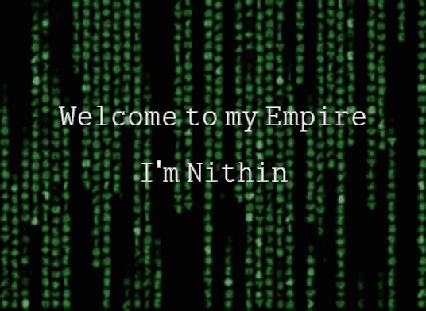

# S.Nithin
<h1 align="center">Hi 👋, I'm S Nithin</h1>
<h3 align="center">BTECH STUDENT | WEB DEVELOPER | PASSIONATE LEARNER</h3>

  

  

  

- 🔭 I’m currently working on [Bring Every Business Online](https://nsk-2001.github.io/DevTask6/)

- 🌱 I’m currently learning **Flutter,Dart**

- 🤝 Intern at GTech MuLearn as Intrest Group Management **Web Bootcamp**

- 📫 How to reach me **nithinsurendra673@gmail.com**

<h3 align="left">Connect with me:</h3>

<h3 align="left">Languages and Tools:</h3>

         

&nbsp;

